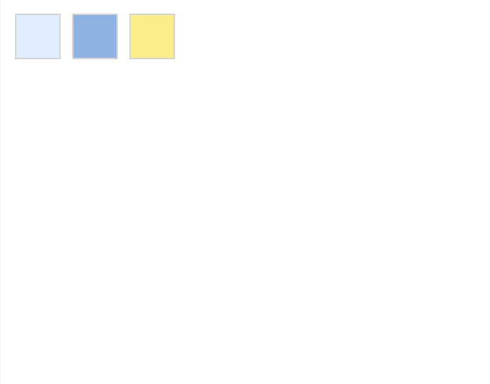

# easyUI拖拽 jQueryeasyUIdrage

效果如下：



代码如下：
```
<!doctype html>
<html lang="en">
<head>
    <meta charset="UTF-8">
    <title>Insert title here</title>
	<style>
		.dd-demo{
			width:60px;
			height:60px;
			border:2px solid #d3d3d3;
			position:absolute;
		}
		.proxy{
			border:1px dotted #333;
			width:60px;
			height:60px;
			text-align:center;
			background:#fafafa;
		}
		#dd1{
			background:#E0ECFF;
			left:20px;
			top:20px;
		}
		#dd2{
			background:#8DB2E3;
			left:100px;
			top:20px;
		}
		#dd3{
			background:#FBEC88;
			left:180px;
			top:20px;
		}
	</style>
</head>
<body>
<div id="dd1" class="dd-demo"></div>
<div id="dd2" class="dd-demo"></div>
<div id="dd3" class="dd-demo"></div>
</body>
</html>
<script src="http://code.jquery.com/jquery-1.4.4.min.js"></script>
<script src="http://www.w3cschool.cc/try/jeasyui/jquery.easyui.min.js"></script>
<script>
	$(function(){
		$('#dd1').draggable();
		$('#dd2').draggable({
			proxy:'clone'
		});
		$('#dd3').draggable({
			proxy:function(source){
				var p = $('<div class="proxy">proxy</div>');
				p.appendTo('body');
				return p;
			}
		});
	});
</script>

```
